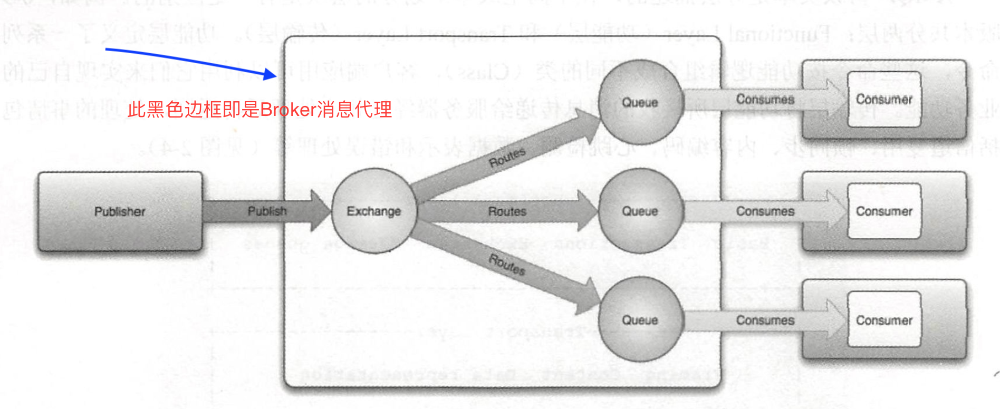
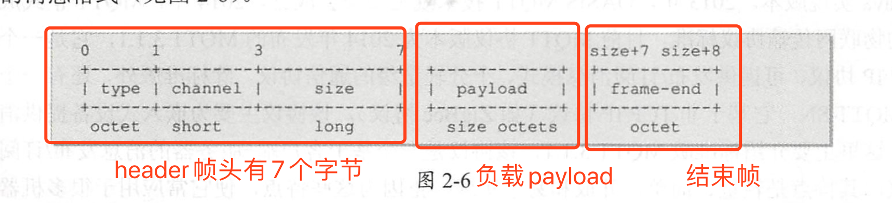

## 消息协议
# 1.AMQP
 > 分为三部分:基本概念、功能命令、传输层协议

1.1  主要概念    

    1.1.1 Message(消息):消息服务器处理数据的最小单元,格式上包括内容头、属性、内容体,可以是任何元素
    1.1.2 Publisher(生产者):生产消息的应用程序
    1.1.3 Exchange(交换器):接收消息并转发给服务器队列
    1.1.4 Binding(绑定):将交换器和队列关联起来的规则
    1.1.5 Virtual Host(虚拟主机):mini版的消息服务器,有自己的体系
    1.1.6 Broker(消息代理):消息队列服务器实体,接受客户端连接
    1.1.7 Routing Key(路由规则):虚拟机可以用它来连接消息
    1.1.8 Queue(消息队列):消息容器,保存消息直到发给消费者
    1.1.9 Connection(连接):可以理解为消息服务器和消息服务器的连接
    1.1.10 Channel(信道):是消息订阅发布的通道
    1.1.11 Consumer(消费者):从消息队列中获取消息的客户端程序
1.2  核心组件生命周期
    
    
    1.2.1 消息的生命周期
      上述图片讲述的消息生命周期,由Publisher(生产者)产生一条数据,发送到Broker(消息代理),Broker中的Exchange(交换器)一个规则表
      (Routing Key和Queue的映射关系Binding),Broker收到消息后根据 Routing Key(路由规则)查询投递的目标Queue(队列),
      Consumer(消费者)向Broker(消息代理)发送订阅时会指定自己监听哪个Queue(队列),当有数据到达Queue(队列)时Broker(消息代理)
      会推送数据到Consumer(消费者)。
    1.2.2 交换器的生命周期
      每台AMQP服务器都预先创建了许多交换器实例,它们在服务器启动时就存在并且不能被销毁,如果你的应用程序有特殊要求,
      则可以选择自己创建交换器,并在完成工作后进行销毁。
    1.2.3 队列的生命周期
      队列主要分为两种:持久化队列和临时队列
      持久化消息队列可被多个消费者共享,不管是否有消费者接收,它们都可以独立存在 
      临时消息队列对某个消费者是私有的,只能绑定到此消费者,当消费者断开连接时,该消息队列将被删除。
1.3  功能命令

      是协议对外提供的一套可操作的命令集合,应用程序正是基于这些命令来实现自己的业务功能的,每个命令按照类＋方法＋参数的方式来组织描述。
1.4  消息数据格式  
    
    
    1.4.1 AMQP是二进制协议
    1.4.2 AMQP定义了如下帧类型 
         type= 1,"METHOD":方法帧,
         type= 2,"HEADER::内容头帧,
         type= 3,"BODY":内容体帧,
         type= 4,"HEARTBEAT:心跳帧

# 2.MQTT(消息队列遥测传输)
   是一种即时通讯协议,支持所有平台
   
    2.1
    2.2
    2.3
# 3.STOMP
# 4.XMPP
# 5.JMS
# 6.总结
